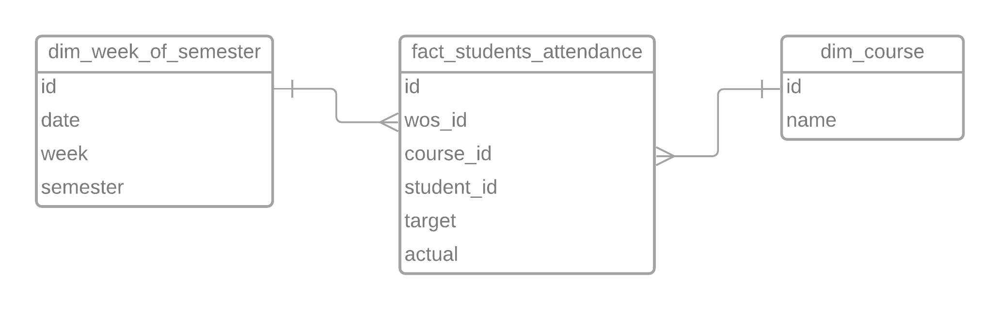

# agriaku

This project is about to build data warehouse schema to be presented in dashboard analytics later. It is derived from source data of course attendance from a university. There are 13 weeks for each semester. For simplicity, we assume that there is no holiday throughout the semesters.

The goal of this project is to present the report of the course attendance percentage throughout the semesters. The report schema will be as follow.
- `SEMESTER_ID`, either 1 or 2.
- `WEEK_ID`, from 1 to 13.
- `COURSE_NAME`.
- `ATTENDANCE_PCT` which represents the percentage of course attendance.

## Data source
There are four data sources provided for this project. They are all located in the folder **`./data source/`**.
- `course_attendance.csv`
- `course.csv`
- `enrollment.csv`
- `schedule.csv`

## Schema of data warehouse
Schema of data warehouse is shown as below.


## Preparation
Before running the pipelines, it is required to prepare the dependencies first. Since this project uses virtual environment and python supports it, it can be done by doing so. The following commands are for windows.
```bash
python -m venv ./venv
venv/Scripts/activate.bat
pip install -r requirements.txt
```

## Data pipelines
In order to fill the schema as shown above, there are 7 data pipelines to run. These pipelines must follow the order as follows.
- preparation.py
    - This pipeline is to prepare the folders that we need before running other pipelines. This will provide folders such data staging and destination.
    - To run the pipeline, just run this command in the command line
    ```bash
    python preparation.py
    ```
- normalize_schedule.py
    - This pipeline is to normalize the schedule.csv data. It contains column of `COURSE_DAYS` that has multiple data. This should be prepared properly by separating each data one per row.
    - To run the pipeline, just run this command in the command line
    ```bash
    python normalize_schedule.py
    ```
- create_weeks_of_semester.py
    - This pipeline is to create dimension of week_of_semester.
    - To run the pipeline, just run this command in the command line
    ```bash
    python create_weeks_of_semester.py
    ```
- create_target_attendance.py
    - This pipeline is to create the measurement of how the students should attend the class throughout the whole year.
    - To run the pipeline, just run this command in the command line
    ```bash
    python create_target_attendance.py
    ```
- create_actual_attendance.py
    - This pipeline is to create the measurement of how the students come to the class in reality.
    - To run the pipeline, just run this command in the command line
    ```bash
    python create_target_attendance.py
    ```
- create_fact_attendance.py
    - This pipeline is to create the fact table. It comes from both target_attendance and actual_attendance.
    - To run the pipeline, just run this command in the command line
    ```bash
    python create_fact_attendance.py
    ```
- create_summary.py
    - This pipeline is to return the summary of the report as the result to show.
    - To run the pipeline, just run this command in the command line
    ```bash
    python create_summary.py
    ```